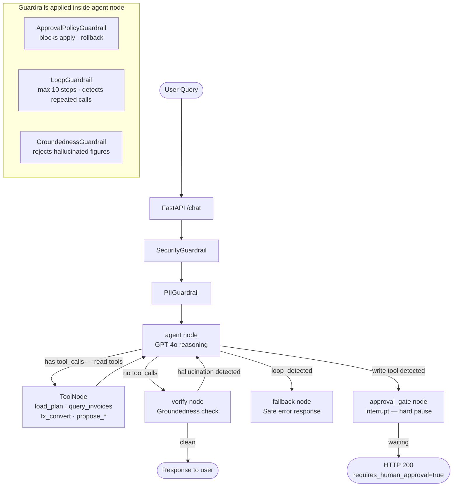
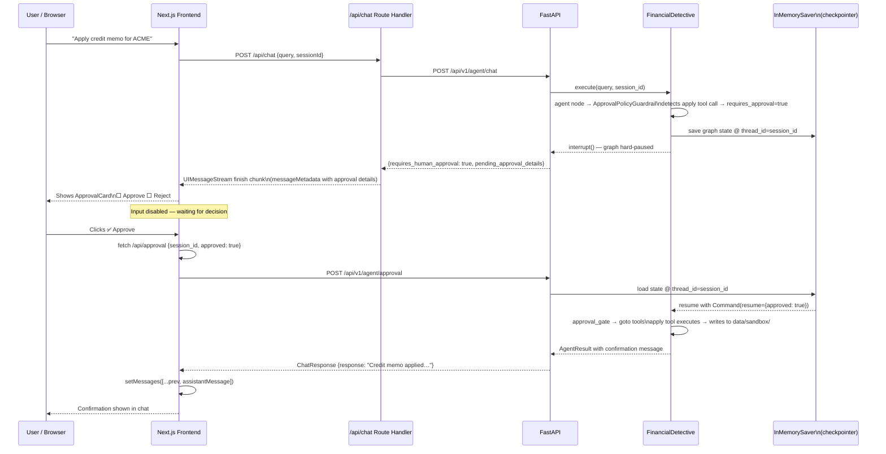
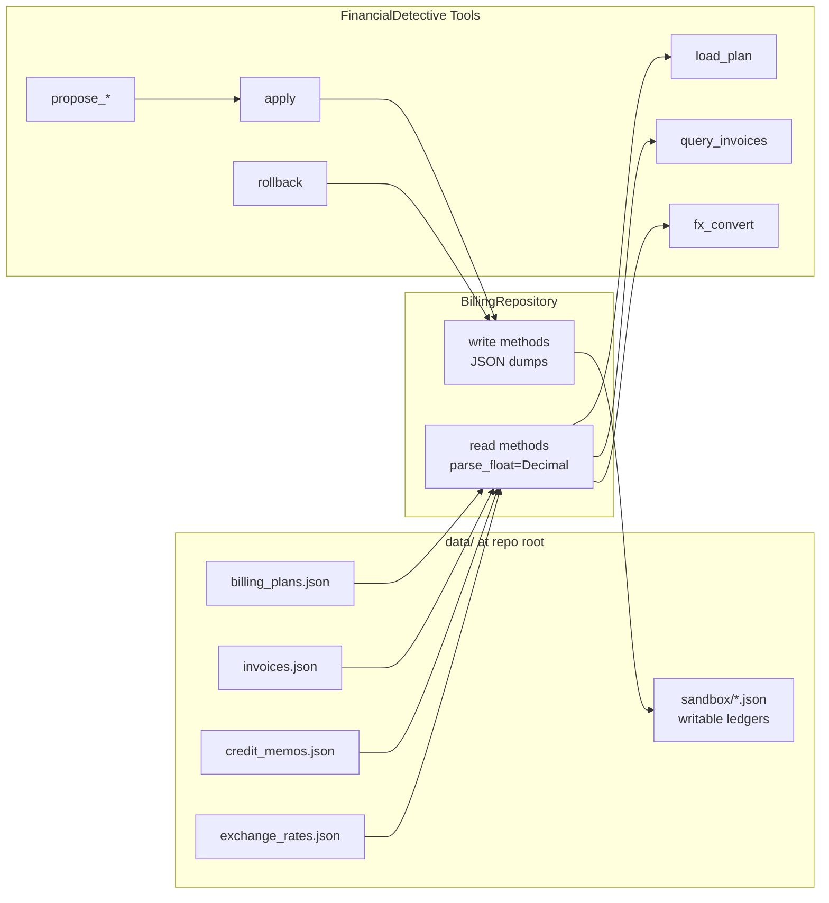

# Architecture Diagrams

## Agent Graph Design

How the `FinancialDetective` LangGraph nodes connect and route:

## Human-in-the-Loop Flow

How the approval interrupt works end-to-end between browser and LangGraph:

## Data Flow

How data moves from source JSON through the agent to the sandbox:

