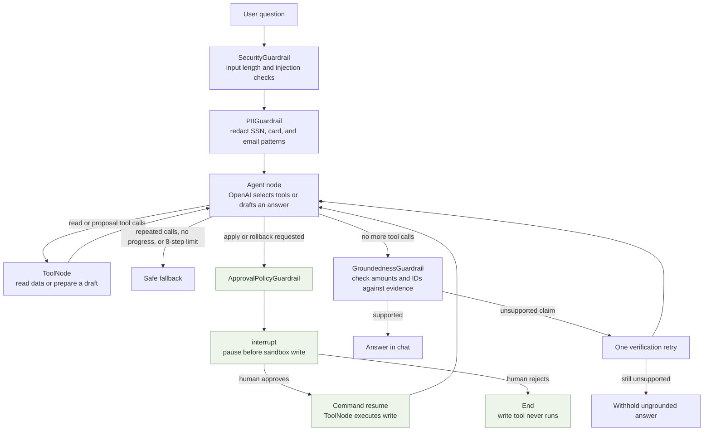
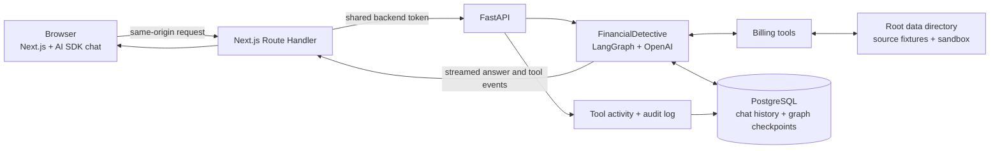

# LedgerLens

LedgerLens is a financial detective that investigates billing plans against invoices, explains revenue leakage with supporting evidence, and prepares corrective actions for human approval in a sandbox.

## How the AI investigation works

The agent is a LangGraph state machine. It validates each question, asks OpenAI to reason over the available tools, and loops between the model and tools until it can provide a grounded answer or needs a human decision.



### Tools, guardrails, and approval

| Purpose | Tools or behavior |
| --- | --- |
| Read billing evidence | `load_plan`, `query_invoices`, `fx_convert` |
| Prepare corrective actions | `propose_make_good_invoice`, `propose_credit_memo`, `propose_plan_amendment` (draft only) |
| Write to the sandbox | `apply`, `rollback` (both pause for explicit approval) |
| Stop repeated work | `LoopGuardrail` caps an agent turn at 8 steps, blocks a third identical call, and detects repeated results that show no progress |
| Verify the answer | `GroundednessGuardrail` checks amounts and IDs against the user’s question and tool results; it allows one rewrite attempt |

The approval is attached to the chat’s LangGraph thread. Approving resumes the saved graph with `Command(resume=...)` and lets the `ToolNode` run the requested write. Rejecting ends the graph before the write tool executes. Applying adds the approved draft to the sandbox; rolling back removes the selected sandbox action. Both write an audit event.

## Application architecture



The frontend proxies requests through Next.js Route Handlers to FastAPI. Chat transcripts, tool activity, approvals, and LangGraph checkpoints persist in PostgreSQL. Source billing fixtures and sandbox writes live under the repository-root `data/` directory. Each visitor supplies their own OpenAI API key; it stays in that browser tab’s memory and is passed to the backend for model calls without being stored in chat history or PostgreSQL.

See [the detailed agent and approval diagrams](docs/architecture-diagrams.md) for the graph and approval sequence.

## What it does

- Investigates billing plans, invoices, credit memos, and foreign exchange adjustments.
- Proposes make-good invoices, credit memos, and plan amendments.
- Requires explicit approval before sandbox changes are applied or rolled back.
- Keeps chat history and LangGraph checkpoints in PostgreSQL.
- Shows tool activity, billing fixtures, and an audit log in the web app.

## Run with Docker

Copy the environment templates:

```bash
cp env/agent/.env.example env/agent/.env
cp env/frontend/.env.local.example env/frontend/.env.local
```

Generate a random `BACKEND_API_TOKEN` and set the same value in both env files. It must be at least 32 characters. The frontend session also needs an `AUTH_SESSION_SECRET` of at least 32 characters; generate one with:

```bash
python -c "import secrets; print(secrets.token_urlsafe(48))"
```

Each visitor enters their own OpenAI API key on the login page. The app holds it in that browser tab's memory and sends it to the agent service for each model request; it is not saved in chat history or the database. Sign-in uses GitHub SSO: create a GitHub OAuth App with callback URL `http://localhost:3000/api/auth/github/callback`, then set `GITHUB_CLIENT_ID` and `GITHUB_CLIENT_SECRET` (any GitHub account can sign in) in `env/frontend/.env.local`.

Start the application:

```bash
python run.py docker up
```

Open [http://localhost:3000](http://localhost:3000). The API health endpoint is [http://localhost:8000/health](http://localhost:8000/health), and Jaeger is at [http://localhost:16686](http://localhost:16686).

To stop the services while preserving chat and sandbox data:

```bash
python run.py docker down
```

## Local development

Start PostgreSQL, install the Python dependencies, and run the API:

```bash
docker compose up -d postgres
python run.py sync
python run.py dev
```

In another terminal, start the frontend:

```bash
cd services/frontend
npm install
npm run dev
```

Docker development mounts enable backend and frontend hot reload. See [AGENTS.md](AGENTS.md) for the repository architecture and additional commands.
